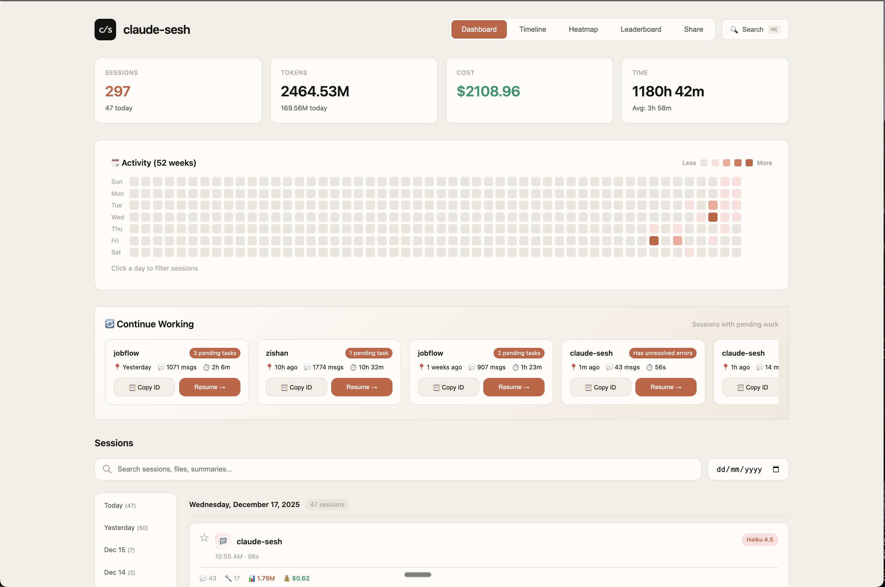

<div align="center">

# 🗂️ claude-sesh

### Your Claude Code sessions, organized.

<br />

**Claude Code buries your sessions in `~/.claude/projects/`.**
**Good luck finding that conversation from last week.**

<br />

[](https://www.npmjs.com/package/claude-sesh)
[](https://www.npmjs.com/package/claude-sesh)
[](LICENSE)
[](https://modelcontextprotocol.io)

<br />

```bash
npx claude-sesh web
```

**One command. Zero config. Your entire Claude Code history.**

<br />

[Features](#features) · [Quick Start](#quick-start) · [Dashboard](#-web-dashboard) · [CLI](#-cli-commands) · [MCP](#-mcp-integration)

<br />



</div>

<br />

---

<br />

## Features

<table>
<tr>
<td width="50%">

### 🔍 Session Explorer

**Find any conversation instantly.**

Browse your complete Claude Code history with powerful filtering by project, date, model, and more. Never lose track of that perfect solution again.

</td>
<td width="50%">

### 🔎 Full-Text Search

**Search across everything.**

Find sessions by code snippets, error messages, or any text. Search spans all your conversations, tool calls, and outputs.

</td>
</tr>
<tr>
<td width="50%">

### 📊 Usage Analytics

**Know where your tokens go.**

Track costs, token usage, and coding time across all sessions. See breakdowns by project, model, and time period.

</td>
<td width="50%">

### 🔄 Easy Resume

**Pick up where you left off.**

Get rich context summaries to continue any session. Copy resume prompts or use Claude's native resume feature.

</td>
</tr>
<tr>
<td width="50%">

### 🏷️ AI Enrichment

**Auto-generated insights.**

Let AI summarize sessions, extract key decisions, and add searchable tags. Powered by your Anthropic API key.

</td>
<td width="50%">

### 🧠 MCP Integration

**Give Claude memory.**

Let Claude search your past sessions directly. Ask "How did I solve this before?" and get real answers.

</td>
</tr>
</table>

<br />

---

<br />

## Quick Start

<table>
<tr>
<td>

### ⚡ Try instantly

```bash
npx claude-sesh web
```

Opens `http://localhost:3847` with your full Claude Code history.

**No install. No config. No API keys.**

</td>
<td>

### 📦 Install globally

```bash
npm install -g claude-sesh
```

Then use the CLI anywhere:

```bash
sesh list          # List sessions
sesh search "bug"  # Search conversations
sesh stats         # View analytics
sesh web           # Launch dashboard
```

</td>
</tr>
</table>

<br />

---

<br />

## 🖥️ Web Dashboard

```bash
sesh web
```

<br />

<table>
<tr>
<td align="center" width="33%">
<h3>📈</h3>
<b>Stats at a Glance</b><br/>
<sub>Total tokens, cost, hours coded</sub>
</td>
<td align="center" width="33%">
<h3>📅</h3>
<b>Activity Heatmap</b><br/>
<sub>GitHub-style contribution graph</sub>
</td>
<td align="center" width="33%">
<h3>⏱️</h3>
<b>Session Timeline</b><br/>
<sub>Visual history of all your work</sub>
</td>
</tr>
<tr>
<td align="center" width="33%">
<h3>🏆</h3>
<b>Leaderboards</b><br/>
<sub>Top projects, tools, models</sub>
</td>
<td align="center" width="33%">
<h3>🔍</h3>
<b>Deep Search</b><br/>
<sub>Find by content, project, date</sub>
</td>
<td align="center" width="33%">
<h3>📋</h3>
<b>Session Details</b><br/>
<sub>Full context for any session</sub>
</td>
</tr>
</table>

<br />

---

<br />

## 💻 CLI Commands

<table>
<tr>
<td width="50%">

**Browse Sessions**
```bash
sesh list              # Recent sessions
sesh ls -n 50          # Last 50 sessions
sesh show <id>         # Session details
sesh projects          # List all projects
```

</td>
<td width="50%">

**Search & Find**
```bash
sesh search "auth"     # Full-text search
sesh continue          # Find resumable sessions
sesh stats             # Overall statistics
```

</td>
</tr>
<tr>
<td width="50%">

**Resume Work**
```bash
sesh resume <id>           # Get resume context
sesh resume <id> --copy    # Copy to clipboard
sesh resume <id> --native  # Use Claude's resume
```

</td>
<td width="50%">

**AI Features**
```bash
sesh enrich            # Generate AI summaries
sesh enrich --limit 20 # Enrich 20 sessions
sesh enrich --stats    # Check progress
```

</td>
</tr>
</table>

<br />

---

<br />

## 🧠 MCP Integration

**Give Claude access to your session history.**

```bash
claude mcp add claude-sesh --scope user -- npx claude-sesh mcp
```

Restart Claude Code. Now ask things like:

> *"What was I working on in this project?"*
> *"How did I solve the caching issue before?"*
> *"What files have changed recently?"*

<br />

<details>
<summary><b>Available MCP Tools</b></summary>

<br />

| Tool | Description |
|------|-------------|
| `search_sessions` | Full-text search across all sessions |
| `get_session` | Get detailed info about a specific session |
| `get_project_context` | Recent sessions, decisions, todos for a project |
| `get_pending_todos` | Find incomplete tasks across sessions |
| `search_decisions` | Find past architectural decisions |
| `search_knowledge` | Search learnings and solutions |
| `get_file_history` | Track changes to specific files |
| `get_recent_activity` | Summary of recent coding activity |

</details>

<br />

---

<br />

## 🏷️ AI Enrichment

**Auto-generate summaries and tags for better search.**

```bash
export ANTHROPIC_API_KEY=your-key
sesh enrich
```

<table>
<tr>
<td width="25%" align="center"><b>📝 Summary</b><br/><sub>What was accomplished</sub></td>
<td width="25%" align="center"><b>🎯 Decisions</b><br/><sub>Key choices made</sub></td>
<td width="25%" align="center"><b>🐛 Problems</b><br/><sub>Issues & solutions</sub></td>
<td width="25%" align="center"><b>🏷️ Tags</b><br/><sub>Auto-categorization</sub></td>
</tr>
</table>

<br />

---

<br />

## How It Works

```
┌────────────────────────────────────────────────────────────────┐
│  Claude Code writes sessions to ~/.claude/projects/           │
│  ↓                                                             │
│  claude-sesh parses & aggregates session data                  │
│  • Token counts, costs, duration                               │
│  • Tool usage breakdown                                        │
│  • File changes tracked                                        │
│  ↓                                                             │
│  AI Enrichment (optional)                                      │
│  • Auto-generate summaries                                     │
│  • Extract key decisions                                       │
│  • Add searchable tags                                         │
│  ↓                                                             │
│  Web Dashboard & CLI                                           │
│  • Search all sessions                                         │
│  • View analytics & trends                                     │
│  • Resume past work                                            │
└────────────────────────────────────────────────────────────────┘
```

**Your data stays local.** claude-sesh reads Claude's existing session files. Nothing is uploaded anywhere.

<br />

---

<br />

## 🔒 Privacy & Security

<table>
<tr>
<td align="center">💾<br/><b>100% Local</b><br/><sub>All data stays on your machine</sub></td>
<td align="center">👀<br/><b>Read-Only</b><br/><sub>Never modifies Claude's files</sub></td>
<td align="center">📡<br/><b>No Telemetry</b><br/><sub>Zero data collection</sub></td>
</tr>
</table>

<br />

---

<br />

## Configuration

<details>
<summary><b>Change Dashboard Port</b></summary>

```bash
sesh web --port 8080
```

</details>

<details>
<summary><b>Data Locations</b></summary>

Claude Code sessions:
```
~/.claude/projects/[project-path]/[session-id].jsonl
```

Enriched data (optional):
```
~/.claude-sesh/enriched/[session-id].json
```

</details>

<details>
<summary><b>Troubleshooting</b></summary>

**Dashboard not loading?**
```bash
lsof -i :3847        # Check if port in use
sesh web --port 8080 # Try different port
```

**Search returning nothing?**
- Try broader search terms
- Run `sesh enrich` to improve searchability

**MCP not working?**
- Restart Claude Code after adding MCP server
- Verify with `claude mcp list`

</details>

<br />

---

<br />

## Contributing

We welcome contributions! See [CONTRIBUTING.md](CONTRIBUTING.md) for guidelines and our roadmap.

<br />

---

<br />

<div align="center">

**Built for the Claude Code community** ❤️

[Report Bug](https://github.com/abracadabra50/claude-sesh/issues) · [Request Feature](https://github.com/abracadabra50/claude-sesh/issues) · [Discussions](https://github.com/abracadabra50/claude-sesh/discussions)

<br />

MIT License · [Claude Code](https://docs.anthropic.com/en/docs/claude-code) · [Model Context Protocol](https://modelcontextprotocol.io)

</div>
